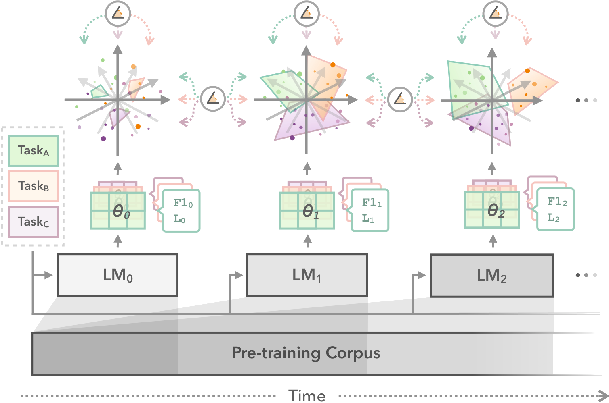

# Subspace Chronicles

This repository contains implementations of the methods from **"Subspace Chronicles: How Linguistic Information Emerges, Shifts and Interacts during Language Model Training"** ([Müller-Eberstein, van der Goot, Plank and Titov, 2023](https://personads.me/x/emnlp-2023); Findings of EMNLP 2023), as well as for the representational stability experiments in **"PolyPythias: Stability and Outliers across Fifty Language Model Training Runs"** ([van der Wal et al.](https://mxij.me/x/polypythias)), 2025; ICLR 2025).



After installing the required packages, and downloading external datasets, the EMNLP experiments can be re-run using the `scripts/multiberts/run.sh` script, while the ICLR experiments can be run using the `scripts/pythia/run.sh` scripts.

 Please see the instructions below for details.

## Installation

This repository uses Python 3.6+ and the associated packages listed in the `requirements.txt` (a virtual environment is recommended):

```bash
(venv) $ pip install -r requirements.txt
```


## Experiments

### Probing

To run experiments on the nine tasks covered in the main paper, first download and convert each task dataset using the respective scripts in `tasks/`. Most datasets will be automatically downloaded from HugginFace Hub, however some require manual downloads from the original repositories. Finally, start each experiment using the `scripts/multiberts/run.sh` script as follows:

```bash
run.sh -m "mdl/linear()" -d "pos" -t "probe"
run.sh -m "mdl/linear()" -d "dep" -t "probe"
run.sh -m "mdl/linear()" -d "semtag" -t "probe"
run.sh -m "mdl/linear()" -d "ner" -t "probe"
run.sh -m "mdl/linear()" -d "coref" -t "probe"
run.sh -m "mdl/linear()" -d "topic" -t "probe"
run.sh -m "mdl/linear()" -d "senti" -t "probe"
run.sh -m "mdl/linear()" -d "qa" -t "probe"
run.sh -m "mdl/linear()" -d "nli" -t "probe"
```

### Full Fine-tuning

For fully fine-tuning the LM set the `-t` flag to `"full"`, and supply the appropriate pooling parameter for sequence-level classification tasks:

```bash
run.sh -m "mdl/linear()" -d "pos" -t "full"
run.sh -m "mdl/linear()" -d "dep" -t "full"
run.sh -m "mdl/linear()" -d "semtag" -t "full"
run.sh -m "mdl/linear()" -d "ner" -t "full"
run.sh -m "mdl/linear()" -d "coref" -t "full"
run.sh -m "mdl/linear()" -d "topic" -t "full" -p "first"
run.sh -m "mdl/linear()" -d "senti" -t "full" -p "first"
run.sh -m "mdl/linear()" -d "qa" -t "full"
run.sh -m "mdl/linear()" -d "nli" -t "full" -p "first"
```

## Language Model Training

Training scripts for language model training can be found in `scripts/multiberts/pretraining/`. Specifically, first create the pre-processed corpus for masked language modeling and next sentence prediction, and then start the training script:

```bash
python scripts/multiberts/pretraining/preprocess.py --out-path ~/path/to/dataset/
python scripts/multiberts/pretraining/mlm.py --data-path path/to/dataset/books-wiki.json --exp-path path/to/output/ --seed 0
```

The early pre-training checkpoints used in the paper are available on HuggingFace Hub as the [**EarlyBERTs**](https://huggingface.co/collections/personads/earlyberts-6720bf519be2d656a13d7836).
